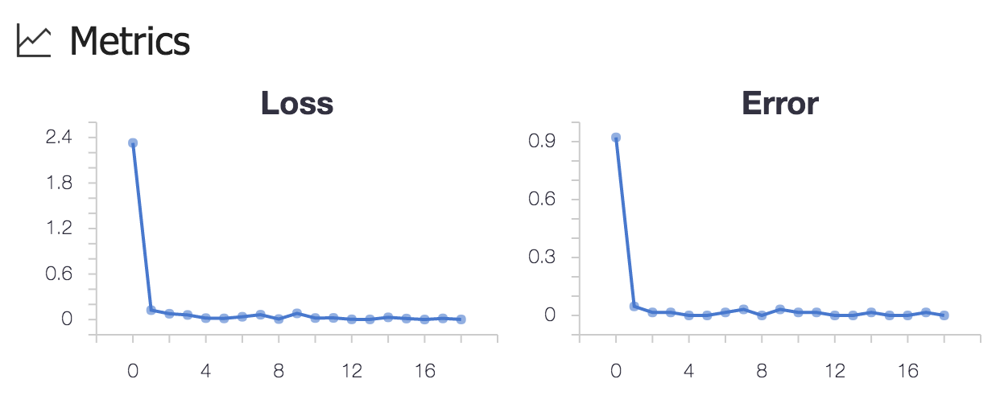

# Classifying MNIST dataset using CNTK

This sample uses CNTK to create a multi-layer neural network to classify MNIST dataset.

The code in this sample is adapted from the following CNTK tutorials:
1. https://github.com/Microsoft/CNTK/blob/v2.0/Tutorials/CNTK_103A_MNIST_DataLoader.ipynb
2. https://github.com/Microsoft/CNTK/blob/v2.0/Tutorials/CNTK_103C_MNIST_MultiLayerPerceptron.ipynb

## Logging code
In this sample, we demonstrate how to use Azure ML logging APIs to record important metrics during training.

Here are the relevant code snippets from the `cntk_mnist.py` script:

```python
# reference the Azure ML logging library
from azureml.logging import get_azureml_logger
...
# initialize the logger
run_logger = get_azureml_logger()
...
# declare empty lists
losses = []
errors = []
# during the training session
for i in range(0, int(num_minibatches_to_train)):
    ...
    # record error and loss into a list
    metrics.append(float(error))
    losses.append(float(loss))
    ...

# after the training finishes, log the list of errors and losses
run_logger.log("Loss", losses)
run_logger.log("Error",errors)
```

By adding the above logging code, when the run finishes, you can find the following graph plotted for you in the run history detail page.


## Instructions for running the script from CLI window
You can run your scripts from the Workbench app. However, we use the command-line window to watch the feedback in real time.

### Running your CNTK-based script locally
Open the command-line window by clicking on **File** --> **Open Command Prompt** and pip-install the right CNTK version for your platform. You can refer to this article for setting up CNTK for Python library: [Setup CNTK on your machine](https://docs.microsoft.com/cognitive-toolkit/Setup-CNTK-on-your-machine)

Once you select the right wheel file for your platform, you can install it locally by running the following command in your CLI command prompt.
```
# You only need to do this once. This whl file is for Windows operating system.
$ pip install https://cntk.ai/PythonWheel/CPU-Only/cntk-2.2-cp35-cp35m-win_amd64.whl
```

Once you install CNTK, you can now run your script using the following command: 
```
# submit the experiment to local execution environment
$ az ml experiment submit -c local cntk_mnist.py
```

### Running your CNTK script on local or remote Docker
If you have a Docker engine running locally, you can run `cntk_mnist.py` in a local docker container. Since Docker-based runs are managed by `conda_dependencies.yml` file, it needs to have a reference to the right whl file. `conda_dependencies.yml` for this sample already has that reference. Note you need to use the Linux build of CNTK because the Docker image is based on Ubuntu.

```yaml

# add this channel in order to conda-install jasper
channels:
    - conda-forge

dependencies:
    # libpng and jasper are required for cntk 2.2
    - libpng=1.2
    - jasper

    # pip install CNTK 2.2. CPU version for Linux
    - pip:
      - https://cntk.ai/PythonWheel/CPU-Only/cntk-2.2-cp35-cp35m-linux_x86_64.whl
```

Run the following command for executing your script on local Docker:
```
# prepare Docker image first
$ az ml experiment prepare -c docker

# submit the experiment to local Docker container for execution
$ az ml experiment submit -c docker cntk_mnist.py
```

You can also execute your script on Docker on a remote machine. If you have a compute target named _myvm_ for a remote VM, you can run the following command to execute your script:

```shell
# prepare Docker image first
$ az ml experiment prepare -c docker

# submit the experiment to the remote Docker container for execution
$ az ml experiment submit -c myvm cntk_mnist.py
```

>Note: The prepare command downloads a base Docker image and configure the necessary Python packages. For that reason, it takes a few minutes to finish. After that, your environment is then cached to make subsequent runs faster. 

## Running it on a VM with GPU
With computationally expensive tasks like training a neural network, you can get a huge performance boost by running it on a GPU-equipped machine.

>Note, if your local machine already has NVidia GPU chips, and you have installed the CUDA libraries and toolkits, you can directly run the script using local compute target. Just be sure to pip-install the CNTK Python package for GPU for your OS. The below instructions are specifically for running script in a remote VM equipped with GPU.

### Step 1. Provision a GPU Linux VM 
Create an Ubuntu-based Data Science Virtual Machine(DSVM) in Azure portal using one of the NC-series VM templates. NC-series VMs are the VMs equipped with GPUs for computation.

### Step 2. Attach the compute context
Run following command to add the GPU VM as a compute target in your current project:
```
$ az ml computetarget attach --name myvm --address <ip address or FQDN> --username <username> --password <pwd> --type remotedocker
```
The above command creates a `myvm.compute` and `myvm.runconfig` file under the `aml_config` folder.

### Step 3. Modify the configuration files under _aml_config_ folder
- You need the CNTK library built for GPU:
    
    In `conda_dependencies.yml` file, replace the CNTK library URL with the GPU version:

     - `https://cntk.ai/PythonWheel/GPU/cntk-2.2-cp35-cp35m-linux_x86_64.whl`

    Or you can use the 1-bit SGD version:

    - `https://cntk.ai/PythonWheel/GPU-1bit-SGD/cntk-2.2-cp35-cp35m-linux_x86_64.whl`

    You can find the latest CNTK Python library for Linux at the [CNTK documentation site](https://docs.microsoft.com/en-us/cognitive-toolkit/Setup-Linux-Python?tabs=cntkpy22).

- You need a different base Docker image with CUDA libraries preinstalled:

    In `myvm.compute` file, replace the value of `baseImage` from `microsoft/mmlspark:plus-0.7.91` to  `microsoft/mmlspark:plus-gpu-0.7.91`

- You need to use _nvidiaDocker_ command to start the Docker container as opposed to the regular _docker_ command.

    In `myvm.compute` file, add a line: `nvidiaDocker: true`

- Optionally, you can to specify the run time framework as _Python_ as opposed to _PySpark_ to gain a little more efficiency:

    In `myvm.runconfig` file,  change the value of `Framework` from `PySpark` to `Python`.

### Step 4. Run the script.
```shell
# prepare your Docker image on the GPU VM.
$ az ml experiment prepare -c myvm

# run the MNIST classification script
$ az ml experiment submit -c myvm cntk_mnist.py
```
You should notice the script finishes significantly faster than if you use CPU. And the command-line outputs should indicate that GPU is used for executing this script.
